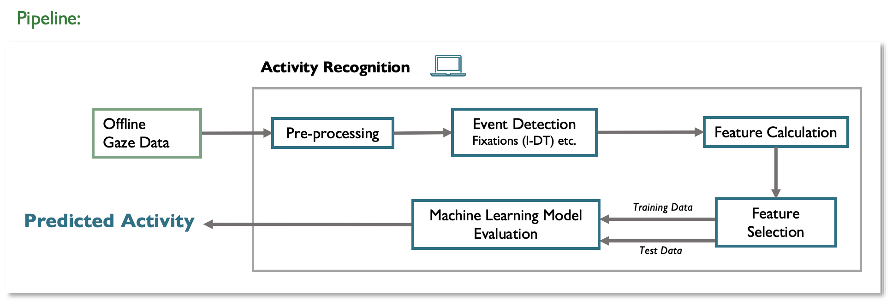

# ETRA26-EYECARE-Tutorial

This repository contains the notebooks for the ETRA 2026 tutorial 
**EYE-CARE: Eye Tracking for Context-Adaptive Systems Based on Activity and Cognitive Load Prediction**. 
Date: June 1st, 13:30 - 17:00 (Marrakech, Morocco local time)

The notebooks show a compact pipeline from raw HoloLens 2 gaze data to gaze features, activity prediction, and task-adaptive AI support.

The pipeline starts with raw eye-tracking logs collected from the Microsoft HoloLens 2 through ARETT. The data is visualized and converted into gaze features. These features are then used to train an SVM classifier for activity recognition. The predicted activity can be forwarded to an intervention service that selects an activity-specific prompt and demo image, then returns AI-generated support for the detected task.

## Notebooks

- [`ReadAndVisualizeRawHL2GazeData.ipynb`](ReadAndVisualizeRawHL2GazeData.ipynb): Loads raw HoloLens 2 gaze CSV files, inspects columns, and visualizes different gaze metrics.
- [`FeatureCalculation.ipynb`](FeatureCalculation.ipynb): Implements I-DT-based fixation detection and computes a set of gaze features.
- [`AnSVMClassifierForHL2GazeFeatures.ipynb`](AnSVMClassifierForHL2GazeFeatures.ipynb): Reads the generated feature CSV, trains and evaluates SVM classifiers with different kernels, and predicts activity labels for new feature windows.
- [`InterventionExample.ipynb`](InterventionExample.ipynb): Uses the detected activity to select a demo image and prompt, generates AI support, and can expose the intervention as a small local HTTP service.

## Data and Assets

- `Data/RawGazeData/`: raw gaze recordings used by the visualization and feature calculation notebooks.
- `Data/FeatureFiles/`: feature CSV files used by the SVM classifier notebook.
- `DemoImages/`: example images used by the intervention notebook.
- `Docs/pipeline_overview.png`: overview figure shown above.

## Running in VS Code

1. Open this folder in VS Code.
2. Install the VS Code **Python** and **Jupyter** extensions if they are not already installed.
3. Select a Python kernel for the notebooks. A local virtual environment is recommended.
4. Open each notebook and run the install cell at the top once. The notebooks install their own basic dependencies with `%pip install ...`.
5. Run the notebooks in this order for the full flow:
   1. `ReadAndVisualizeRawHL2GazeData.ipynb`
   2. `FeatureCalculation.ipynb`
   3. `AnSVMClassifierForHL2GazeFeatures.ipynb`
   4. `InterventionExample.ipynb`
6. If you want the classifier in `AnSVMClassifierForHL2GazeFeatures.ipynb` to call the intervention service, first run the service cell in `InterventionExample.ipynb`. It starts a local endpoint at `http://127.0.0.1:5020/intervention`. Then run the classifier cell that calls that endpoint.

